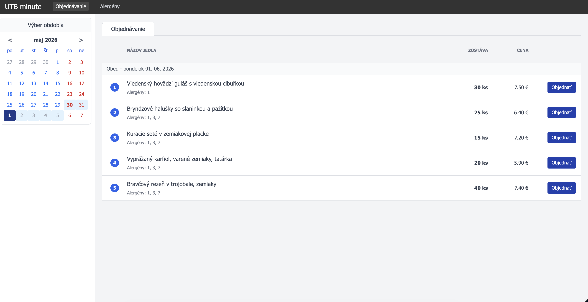

# Menza

Objednávací systém pre našu menzu.

## Popis

Systém je navrhnutý na efektívnu správu a objednávanie jedál na objednávku - minútiek.

1. Študent si vyberie jedlo z aktuálneho menu cez webovú aplikáciu (CanteenClient).
2. Kuchyňa príjme objednávku a mení jej stav v reálnom čase (AdminClient).
3. Študent je informovaný o stave svojej objednávky.

## Stack

- Runtime: .NET 10
- Orchestrácia: .NET Aspire
- Autentifikácia: Keycloak
- API: Minimal Web API s využitím TypedResults
- Frontend: Blazor Server (AdminClient + CanteenClient)
- Databáza: Entity Framework Core + PostgreSQL
- Testovanie: xUnit + Aspire.Hosting.Testing

## Štruktúra

```
.
├── UTB.Minute.AdminClient/      # Blazor Server – správa pre administrátorov/kuchárov
├── UTB.Minute.AppHost/          # Aspire orchestrátor
├── UTB.Minute.CanteenClient/    # Blazor Server – objednávanie pre študentov
├── UTB.Minute.Contracts/        # Spoločné DTO a kontrakty
├── UTB.Minute.Db/               # Databázový model (EF Core)
├── UTB.Minute.DbManager/        # Nástroj na migráciu databázy
├── UTB.Minute.ServiceDefaults/  # Spoločné nastavenia pre Aspire služby
├── UTB.Minute.WebApi/           # Backend API
├── UTB.Minute.WebApi.Tests/     # Integračné testy
├── Keycloak/                    # Konfigurácia autentifikácie (realm)
├── assets/                      # Obrázky a screenshoty
├── global.json
├── README.md
└── UTB.Minute.sln
```

## Autentifikácia (Keycloak)

Systém využíva Keycloak na správu používateľov a rolí. Pri spustení cez Aspire sa automaticky importuje realm s nasledovnými testovacími účtami:

| Používateľ | Heslo | Roly | Popis |
|------------|-------|------|-------|
| `admin` | `admin` | `admin`, `cook` | Plný prístup k správe jedál a objednávok |
| `cook` | `cook` | `cook` | Prístup k správe objednávok (AdminClient) |

Študenti (CanteenClient) momentálne pristupujú k aplikácii bez prihlásenia (anonymne), ale systém je pripravený na rozšírenie.

## Real-time Notifikácie

Pre okamžitú aktualizáciu stavu objednávok v prehliadači bez nutnosti manuálneho obnovovania stránky využíva systém **Server-Sent Events (SSE)**:
- **Backend (WebApi)**: Pushuje udalosti cez stream `OrderCreated` a `OrderUpdated`.
- **Frontend (Blazor)**: `SseClientService` udržiava spojenie a cez udalosti (Events) notifikuje UI komponenty, ktoré následne prečítajú čerstvé dáta z API.

## Dátový model & Stavový stroj

Entity:

- **Meal** – jedlá v databáze (názov, cena, aktívne)
- **MenuItem** – ponuka v daný deň (dátum, dostupné porcie, odkaz na Meal)
- **Order** – objednávky študentov (stav, čas vytvorenia, odkaz na MenuItem)

Životný cyklus objednávky — systém prísne stráži prechody medzi stavmi (napr. nie je možné zrušiť objednávku, ktorá už bola vydaná):

- Preparing ➔ Ready ➔ Completed
- Preparing ➔ Cancelled
- Cancelled ➔ Completed (administrátor môže dokončiť aj zrušenú)

## API endpointy

### Meals

| Metóda | URL | Popis |
|--------|-----|-------|
| GET | `/api/meals` | Všetky jedlá |
| GET | `/api/meals/{id}` | Jedlo podľa Id |
| POST | `/api/meals` | Vytvorenie jedla |
| PUT | `/api/meals/{id}` | Úprava jedla |
| PATCH | `/api/meals/{id}/deactivate` | Deaktivácia jedla |

### Menu

| Metóda | URL | Popis |
|--------|-----|-------|
| GET | `/api/menu` | Všetky položky menu (možný filter ?date=...) |
| GET | `/api/menu/today` | Dnešné menu |
| POST | `/api/menu` | Vytvorenie položky menu |
| PUT | `/api/menu/{id}` | Úprava položky menu |
| DELETE | `/api/menu/{id}` | Zmazanie položky menu |

### Orders

| Metóda | URL | Popis |
|--------|-----|-------|
| GET | `/api/orders` | Aktívne objednávky (Preparing, Ready) |
| POST | `/api/orders` | Vytvorenie objednávky |
| POST | `/api/orders/batch` | Získanie detailov pre zoznam Id |
| PUT | `/api/orders/{id}/status` | Zmena stavu objednávky |

### Notifikácie

| Metóda | URL | Popis |
|--------|-----|-------|
| GET | `/api/notifications/sse` | Server-Sent Events stream pre real-time updaty |

## Architektúra

- **Minimal API** — všetky endpointy sú v jednom súbore `Program.cs` ako pomenované statické metódy.
- **TypedResults** — návratové typy endpointov sú explicitne definované (napr. `Results<Ok<MealDto>, NotFound>`).
- **Record pre DTO** — immutable, štrukturálna rovnosť, stručný zápis.
- **Enum pre stav objednávky** — typovo bezpečné, nemožno zadať neplatný stav.
- **Blazor Server** — interaktívne komponenty s `@rendermode InteractiveServer`.
- **Aspire Service Discovery** — automatické prepojenie klientov s API cez `http://webapi`.
- **Aspire.Hosting.Testing** — testy bežia oproti PostgreSQL databáze spustenej cez Aspire.

## Requirements and Run

- .NET 10+
- Docker

```bash
dotnet run --project UTB.Minute.AppHost
```

Aspire dashboard zobrazí všetky služby.

## Spustenie testov

```bash
dotnet test
```

Testy automaticky spustia PostgreSQL kontajner cez Aspire.

## Pomer práce v tíme

1:2
